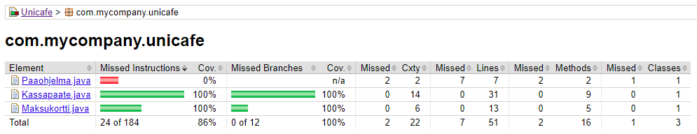

# Stonks

Stonks is a Java application for tracking personal goals.

[Software requirements specification](https://github.com/Eelinki/ot-harjoitustyo/blob/master/docs/software_requirements_specification.md)
[Timesheet](https://github.com/Eelinki/ot-harjoitustyo/blob/master/docs/timesheet.md)

For the course **Ohjelmistotekniikka** in **University of Helsinki**.

## Exercises

### Week 1

* [gitlog.txt](https://github.com/Eelinki/ot-harjoitustyo/blob/master/laskarit/viikko1/gitlog.txt)
* [komentorivi.txt](https://github.com/Eelinki/ot-harjoitustyo/blob/master/laskarit/viikko1/komentorivi.txt)

### Week 2

