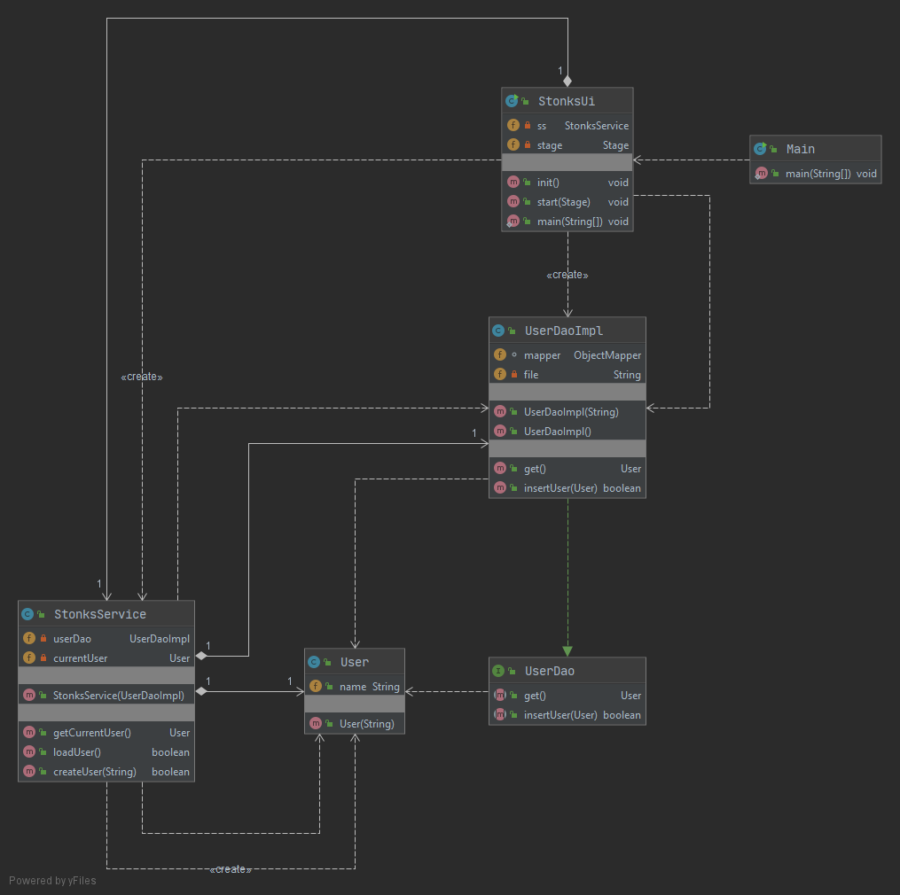
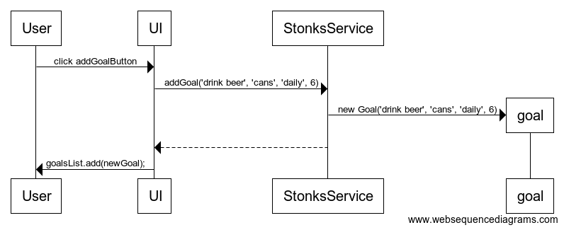

# Architecture

## Application structure

The application has three packages, stonks.ui is responsible for the graphical user interface made using JavaFX. The main functionality is handled by stonks.domain, and stonks.dao is handling the data storage.

## Class diagram



## Graphical user interface

The user interface has three views:

 - Login
 - Goals list
 - Dialog for adding new goals

## Main functionality

### Stonks service

StonksService class acts as an interface between the user interface and the main functionality.

It provides the methods for the necessary use:

 - createUser(String name)
 - loadUser()
 - updateUser()
 - addGoal(Goal goal)

## Data storage

The class UserDaoImpl is responsible for data storage.

### File structure

The application saves a single 'user.json' file for the user (as of now, this only supports a single user profile).

It uses the JavaScript Object Notation (JSON) as the file format.

A typical user file looks something like this:

```
{
   "name":"User name",
   "goals":[
      {
         "name":"drink beer",
         "unit":"cans",
         "routine":"DAILY",
         "goal":6,
         "progress":3
      },
      {
         "name":"play cs",
         "unit":"times",
         "routine":"DAILY",
         "goal":2,
         "progress":2
      },
      {
         "name":"lose motivation",
         "unit":"times",
         "routine":"DAILY",
         "goal":1,
         "progress":1
      }
   ]
}
```

To convert the json file back into a Java Object, the application uses Jackson Databind ObjectMapper class.

## Sequence diagrams

### Creating a new goal

