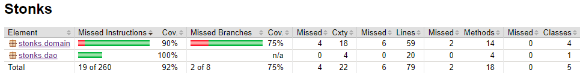

# Testing

The program has been tested using automated JUnit tests. Both unit testing and integration testing has been done.

## Tests

### Main functionality

### Data access object (DAO)

DAO tests are utilizing JUnits TemporaryFolder rules. Tests include file and error handling.

### Graphical user interface

The user interface has been excluded from automated testing.

## Test coverage

The instruction coverage is 92% and branch coverage is 75%.

